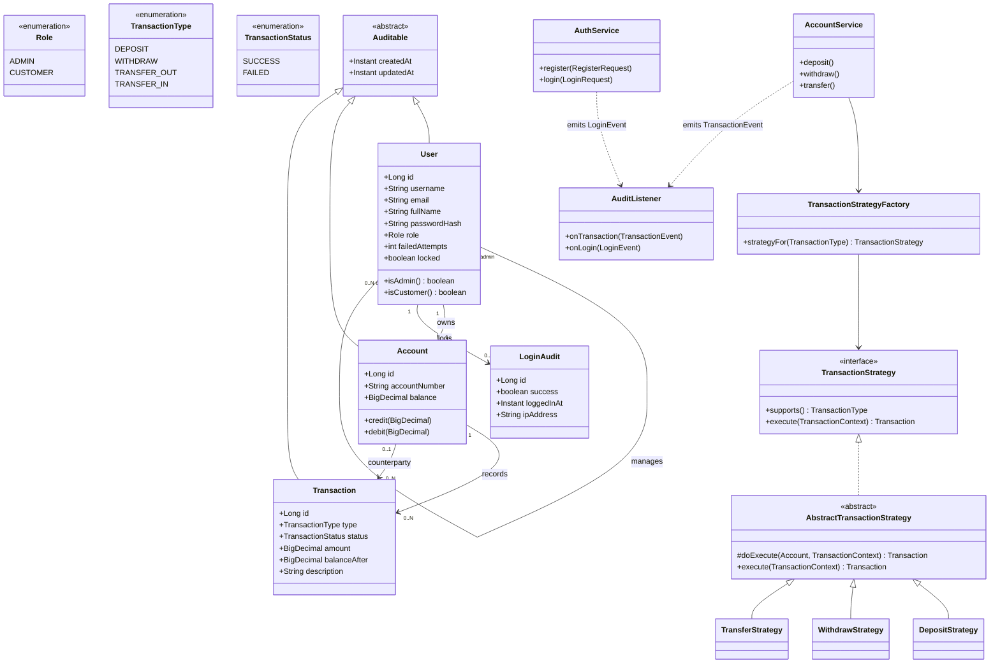
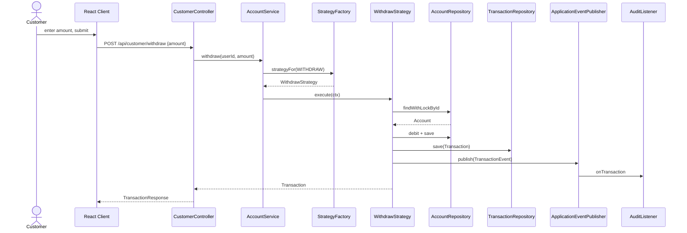
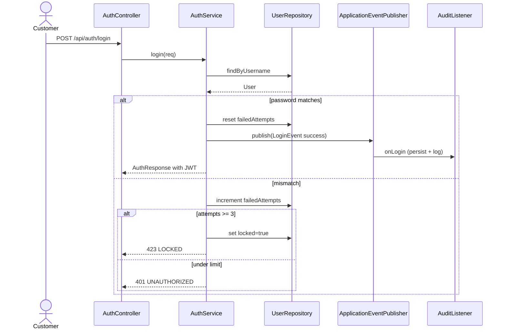

# UML — ATM Bank

## Class diagram (domain + service patterns)

```mermaid
classDiagram
    class Role {
        <<enumeration>>
        ADMIN
        CUSTOMER
    }

    class TransactionType {
        <<enumeration>>
        DEPOSIT
        WITHDRAW
        TRANSFER_OUT
        TRANSFER_IN
    }

    class TransactionStatus {
        <<enumeration>>
        SUCCESS
        FAILED
    }

    class Auditable {
        <<abstract>>
        +Instant createdAt
        +Instant updatedAt
    }

    class User {
        +Long id
        +String username
        +String email
        +String fullName
        +String passwordHash
        +Role role
        +int failedAttempts
        +boolean locked
        +isAdmin() boolean
        +isCustomer() boolean
    }

    class Account {
        +Long id
        +String accountNumber
        +BigDecimal balance
        +credit(BigDecimal)
        +debit(BigDecimal)
    }

    class Transaction {
        +Long id
        +TransactionType type
        +TransactionStatus status
        +BigDecimal amount
        +BigDecimal balanceAfter
        +String description
    }

    class LoginAudit {
        +Long id
        +boolean success
        +Instant loggedInAt
        +String ipAddress
    }

    Auditable <|-- User
    Auditable <|-- Account
    Auditable <|-- Transaction

    User "1 admin" -- "0..N customers" User : manages
    User "1" --> "1" Account : owns
    Account "1" --> "0..N" Transaction : records
    Account "0..1" --> "0..N" Transaction : counterparty
    User "1" --> "0..N" LoginAudit : logs

    class TransactionStrategy {
        <<interface>>
        +supports() TransactionType
        +execute(TransactionContext) Transaction
    }

    class AbstractTransactionStrategy {
        <<abstract>>
        #doExecute(Account, TransactionContext) Transaction
        +execute(TransactionContext) Transaction
    }

    class DepositStrategy
    class WithdrawStrategy
    class TransferStrategy

    class TransactionStrategyFactory {
        +strategyFor(TransactionType) TransactionStrategy
    }

    class AccountService {
        +deposit()
        +withdraw()
        +transfer()
    }

    TransactionStrategy <|.. AbstractTransactionStrategy
    AbstractTransactionStrategy <|-- DepositStrategy
    AbstractTransactionStrategy <|-- WithdrawStrategy
    AbstractTransactionStrategy <|-- TransferStrategy
    TransactionStrategyFactory --> TransactionStrategy
    AccountService --> TransactionStrategyFactory

    class AuditListener {
        +onTransaction(TransactionEvent)
        +onLogin(LoginEvent)
    }

    class AuthService {
        +register(RegisterRequest)
        +login(LoginRequest)
    }

    AuthService ..> AuditListener : emits LoginEvent
    AccountService ..> AuditListener : emits TransactionEvent
```

## Sequence — Withdraw

```mermaid
sequenceDiagram
    actor Customer
    participant UI as React Client
    participant API as CustomerController
    participant Svc as AccountService
    participant Fac as StrategyFactory
    participant Str as WithdrawStrategy
    participant Acc as AccountRepository
    participant Tx as TransactionRepository
    participant Bus as ApplicationEventPublisher
    participant Log as AuditListener

    Customer->>UI: enter amount, submit
    UI->>API: POST /api/customer/withdraw {amount}
    API->>Svc: withdraw(userId, amount)
    Svc->>Fac: strategyFor(WITHDRAW)
    Fac-->>Svc: WithdrawStrategy
    Svc->>Str: execute(ctx)
    Str->>Acc: findWithLockById
    Acc-->>Str: Account
    Str->>Acc: debit + save
    Str->>Tx: save(Transaction)
    Str->>Bus: publish(TransactionEvent)
    Bus->>Log: onTransaction
    Str-->>API: Transaction
    API-->>UI: TransactionResponse
```

## Sequence — Login with lockout

```mermaid
sequenceDiagram
    actor Customer
    participant API as AuthController
    participant Svc as AuthService
    participant Repo as UserRepository
    participant Bus as ApplicationEventPublisher
    participant Log as AuditListener

    Customer->>API: POST /api/auth/login
    API->>Svc: login(req)
    Svc->>Repo: findByUsername
    Repo-->>Svc: User
    alt password matches
        Svc->>Repo: reset failedAttempts
        Svc->>Bus: publish(LoginEvent success)
        Bus->>Log: onLogin (persist + log)
        Svc-->>API: AuthResponse with JWT
    else mismatch
        Svc->>Repo: increment failedAttempts
        alt attempts >= 3
            Svc->>Repo: set locked=true
            Svc-->>API: 423 LOCKED
        else under limit
            Svc-->>API: 401 UNAUTHORIZED
        end
    end
```
